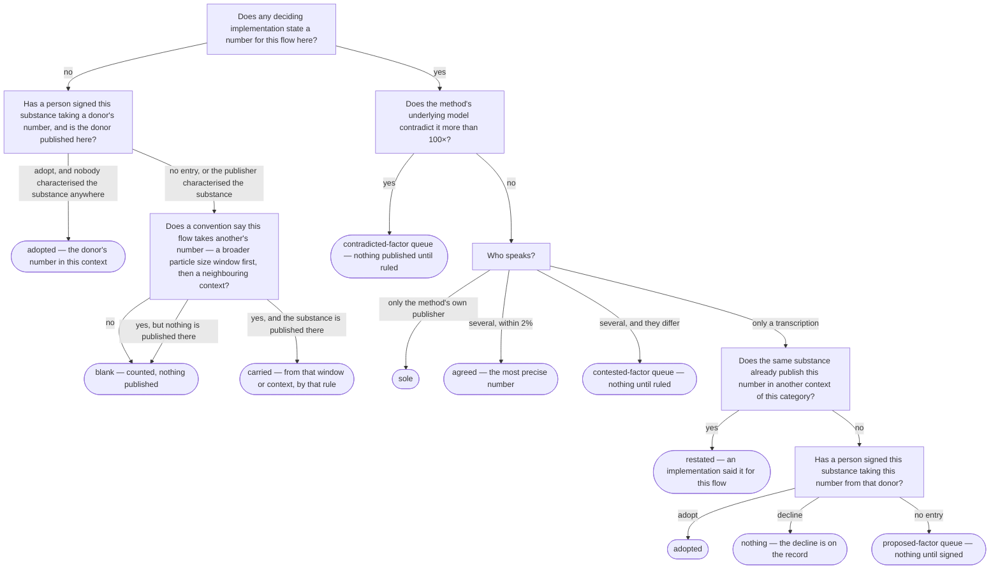

# How a factor is decided

A method is not a number until somebody implements it against a flow list, and
the people who do that do not always get the same answer. EF 3.1 says what
kresoxim-methyl sprayed on a field does to fresh water; the European
Commission's JRC says 134.73 CTUe per kilogram, and the ecoinvent Centre,
implementing the same method against its own flow list, says 53,540. This list
publishes both, each under the name of the team that said it, and then a third
implementation of its own — the **consensus implementation** — which is the
subject of this section.

Every number in that third implementation was arrived at by one of a small
number of routes, the route is written on the factor as its `derivation`, and
the routes fit on one page. This page is that page. Each stage links to the page
that answers it in full; for what the tables and files are called, read
[Characterisation factors](../concepts/factors.md) instead.

Three things are worth knowing before the first stage.

**Nothing here is computed.** No factor is averaged, weighted, interpolated or
modelled. A number in the consensus implementation is a number somebody stated
for that flow, a number a person ruled or signed for, or a number this list's
own convention carried from the context next door — and the factor says which.

**Publishing nothing is a normal outcome.** Where two implementations disagree
and nobody has ruled, where the model a method is built on says the number is
wrong by a hundredfold, where only one transcription speaks and nothing vouches
for it, the consensus implementation publishes **nothing** and asks. The
question goes into a review queue, with the evidence; an empty factor is often a
decision, not a gap.

**The same rules apply to every method.** EF 3.1 is rendered by four
implementations and Stepwise 2006 by one, and the flowchart below runs the same
way over both. What differs is only who is speaking.

## The flowchart

For one substance, one impact category of one method, and one context of our
taxonomy — cadmium, EF 3.1 freshwater ecotoxicity, emitted to a river:

Read in words: a number is published because somebody stated it for this flow,
because a person ruled or signed for it, or because our own convention says this
context takes that one's number — and for no other reason. Nothing crosses from
one substance to another without a signature. Nothing is published where a queue
is still asking. A blank no rule names stays blank and is counted, not queued.

A signature comes in two shapes, and the flowchart has a box for each. Where a
transcription stated a number for the flow — ecoinvent giving `Copper, Ion`
copper's number under EF 3.1 — the signed entry answers that stated row. Where
*nobody* stated anything for the flow — Stepwise 2006 names no zinc ion, and
every ecoinvent zinc emission lands on `Zinc(2+)` — the signed entry says the
substance takes its donor's published number in the same context, and the
convention then treats the ion's other contexts as it treats the element's
([#197](https://github.com/brightway-labs/brightway-flows/issues/197)). Both
publish as `adopted`; both refuse to overwrite anything; the second also refuses
a substance the method's own publisher characterised anywhere, because that
publisher's silence about one category is a decision.

Figures on this page are from the build of 1 September 2026, run
`20260901T0451332605450000`, LCIA run `28e3b69f…`: EF 3.1, with ecoinvent 3.12,
ecoinvent 3.8, BAFU 2026 v1 and Stepwise 2006 merged onto it.

| what the consensus implementation says | EF 3.1 | Stepwise 2006 |
|---|---:|---:|
| `sole` — only the method's own publisher spoke | 296,719 | 9,622 |
| `agreed` — two spoke and said one number | 21,786 | 0 |
| `ruled` — a curator chose between numbers | 45 | 0 |
| `restated` — only a transcription spoke, and this list already carried the number for the same substance next door | 3,818 | 0 |
| `adopted` — a person signed for the substance taking another substance's number | 1,334 | 0 |
| `carried` — nobody characterised the flow; the convention named a neighbour | 1,491 | 8,258 |
| `moved` / `refined` — the two curated corrections | 5 / 8 | 0 |
| **published** | **325,206** | **17,880** |
| open questions — contested / contradicted / proposed | 32 / 8 / 16 | 0 / 0 / 0 |
| blanks left — a flow nobody characterised, next to one somebody did, and no rule for the pair | 3,336 | 2,591 |

Copper is the worked example throughout, as it is for [how a flow is
decided](../deciding/index.md), because its two substances take two different
routes: the metal is stated by everybody, and the ion is stated only by
ecoinvent.

## 1. Who is speaking, and does it count?

An implementation has a *role*. The method's own publisher is its **reference**
— the JRC for EF 3.1, 2.-0 LCA consultants for Stepwise 2006. Anybody else
rendering the same method against their own flow list is a **transcription**:
the ecoinvent Centre's EF 3.1, and GreenDelta's. Ours is the **consensus**, and
it is derived from the others.

Not every transcription counts. GreenDelta's EF 3.1 is published, compared and
shown on every flow's page, and **decides nothing**: their package is a hand
transcription nobody can re-run, so a number of theirs is never evidence for a
number of ours. The method's own file says who decides, and the flowchart's
first question — *does any deciding implementation state a number here?* — is
asked of the JRC and the ecoinvent Centre for EF 3.1, and of one publisher for
Stepwise.

Copper to surface water, freshwater ecotoxicity: the JRC states 46.47592828149169
CTUe/kg, the ecoinvent Centre states the same to the last digit, GreenDelta too.
Two deciding voices, one number: published as `agreed`.

**Where it is written down:** `implementations` in
`data/lcia-impact-categories.json` and `data/stepwise-2006-impact-categories.json`,
with `role` and `decides` on each row.

**In full:** [Who states a number, and whose counts?](implementations.md)

## 2. Does the model underneath say something else?

Before two voices are compared, one check comes first, because agreement can be
worthless: two transcriptions of one file agreeing is not evidence about the
file. EF 3.1's toxicity categories are derived from USEtox 2.1, and where USEtox
states something more than a hundredfold away from EF for a substance in every
compartment, the consensus implementation publishes nothing for that substance
and category, whatever anybody says.

Biphenyl is the case that found this. EF gives it 0.19957 CTUh/kg for non-cancer
human toxicity from urban air — which would make an ordinary industrial chemical
the third most toxic of the 3,380 substances EF characterises there — and USEtox
is 1,400,000× away. Eight questions over four substances are held this way
today, 110 factors, and none has been ruled.

**Where it is written down:** the `contradicted-factor` queue, and
`data/lcia-underlying-model-factors.json`.

**In full:** [What do we do when the model underneath says something else?](model.md)

## 3. Do the voices agree?

Two or more deciding implementations state a number, and they are within 2 % of
each other: the more precise printing is published as `agreed`, and the other is
recorded beside it. Two percent is the same line the rest of this project draws
between a rounding and a disagreement, and it is never crossed over a zero or a
sign change — a stated zero against a number is two implementations disagreeing
about whether something has an effect at all.

Where they differ by more, the honest artifact is a question. Kresoxim-methyl's
397× is the one this section opened with, and it is a `contested-factor` until a
curator rules — which one did, in `data/lcia-factor-rulings.json`, with the
reasoning: EF's own file carries the substance twice under two EC numbers, and
134.73 belongs to the row ecoinvent's flow corresponds to. So the consensus
implementation publishes 134.73 as `ruled`, and the page that asked the question
shows the answer.

A ruling is pinned to the numbers it was written about. If either implementation
revises, the ruling stops applying and the row asks again.

**Where it is written down:** `derivation: agreed` with `also_stated`; the
`contested-factor` queue; `data/lcia-factor-rulings.json`, whose 14 rulings
settle 52 factors on this build.

**In full:** [What do we do when two implementations disagree?](disagreement.md)

## 4. Only one voice, and it is not the method's own

The method's own publisher speaking alone is `sole` — 92 % of EF's consensus
implementation, and all of Stepwise's, because the JRC's flow list *is* the base
list and reaches every flow, while ecoinvent's reaches 7,925. Adopting the
publisher's own number is not a decision.

A **transcription** speaking alone is. ecoinvent characterises flows EF's list
cannot express — silvicultural soil, industrial soil, groundwater, and
substances such as `Copper, Ion` that EF does not list — and for each of those
the question is whether this list should publish ecoinvent's number on a flow
the method's publisher never characterised. Three things can answer it without a
curator looking at the row:

- the same substance already publishes that number in another context of the
  category, within 2 %, so ecoinvent is restating a number this list carries
  rather than proposing one — `restated`, 3,818 factors;
- a curator accepted the substance's numbers as a population, in
  `data/lcia-factor-adoptions.json` — `adopted`, 1,334 factors: 62
  pesticides carrying a catch-all's numbers, and 23 minerals whose number is the
  JRC's element factors weighted by the formula;
- **today**, any flow of the category publishes the very same digits — which is
  how `Copper, Ion` takes copper's 46.47592828149169 as `restated`, and also how
  α‑hexachlorocyclohexane took lindane's 0.00019937 for non-cancer human
  toxicity, a substitution EF's own numbers refute wherever they can be
  compared. This third route is the one being retired, in favour of a signed
  entry per pair.

What none of them answers is a `proposed-factor`: 14 factors on this build, ten
rocks EF never listed and kresoxim-methyl's 53,540 in silvicultural soil.

**Where it is written down:** `derivation: sole` / `restated` / `adopted`; the
`proposed-factor` queue; `data/lcia-factor-adoptions.json`.

**In full:** [What do we do when only one transcription speaks?](one-voice.md)

## 5. Nobody spoke at all

Ammonium to surface water is characterised at 2,493.2 CTUe/kg for freshwater
ecotoxicity, and so is ammonium to unspecified water and to the aquifer.
Ammonium to a **river** — a context BAFU brought, and no method's flow list has
— carried nothing, in any category. That is a **blank**: the flow exists here,
the same substance is characterised next door, and no deciding implementation
states anything for it. Before the convention there were 4,859 of them for EF
3.1 and 10,849 for Stepwise 2006, whose export states one air row per substance.

Whether a blank takes a neighbour's number is not a fact about ammonium, and
not a fact about EF: it is a fact about our own taxonomy, and it is written down
once, as a convention, the same for every method — `data/context-carry-rules.json`.
Each rule is a sentence: *an emission to a river takes the surface-water number,
failing that the unspecified-water number.* Silvicultural and industrial soil
take non-agricultural soil's number, then unspecified soil's; the rural and
urban air compartments take unspecified air's; the class roots take their
children's number only where every published child agrees. Some blanks are left
blank on purpose — agricultural soil, the unconfined aquifer, aircraft cruise
height — and the file says why. Long-term air and water, indoor air and the
ocean are walls nothing crosses.

What ecoinvent did with the same blanks, and what SimaPro does, are recorded
beside each rule as evidence. Neither is the authority: the convention was
decided class by class from the census of the blanks, by the people who run this
list.

**Where it is written down:** `data/context-carry-rules.json`; the blank counts
per context on `/factors/coverage`; `tools/count_context_blanks.py`.

**In full:** [What do we do when nobody characterised the flow?](blanks.md)

## 6. Three passes after the decision

Three curated corrections run over what the flowchart published, and each
writes its own word so a reader can tell it from a decision:

- a number `derive()` put on the wrong flow is **moved** to the flow it is about
  (`data/lcia-misattributed-factors.json`, 5 factors);
- a rounded printing one implementation states is replaced by the precise value
  its own source states — **refined** (`data/lcia-rounded-printings.json`, 8);
- a context nobody characterises is filled from the neighbour the convention
  names — **carried** (`data/context-carry-rules.json`, stage 5 above).
  Sulphuryl difluoride's 4,630 kg CO₂‑eq reaches the urban ground level from
  unspecified air this way, and does not reach indoor air, which is a wall.

## 7. Checking any of it

Every consensus factor carries its `derivation`; every queue row carries what
each implementation stated and the ruling if there is one; every difference
between two implementations is in the difference report; and every curated
answer is a file in the repository with a mandatory comment, never a value typed
into a database.

**In full:** [How do I find out why a factor says what it says?](checking.md)

## The pages in this section

| Page | Asks |
|---|---|
| [Who states a number, and whose counts?](implementations.md) | the roles an implementation can have, and why GreenDelta's EF 3.1 is published and decides nothing |
| [What do we do when the model underneath says something else?](model.md) | USEtox against EF's toxicity numbers, and why agreement is not evidence |
| [What do we do when two implementations disagree?](disagreement.md) | the 2 % line, the contested queue, and what a ruling is pinned to |
| [What do we do when only one transcription speaks?](one-voice.md) | restated, adopted, the signatures that replaced the twin rule, and the proposed queue |
| [What do we do when nobody characterised the flow?](blanks.md) | the blanks, the convention, the walls, and what is left blank on purpose |
| [How do I find out why a factor says what it says?](checking.md) | the derivation words, the tables, the queues and the files |
