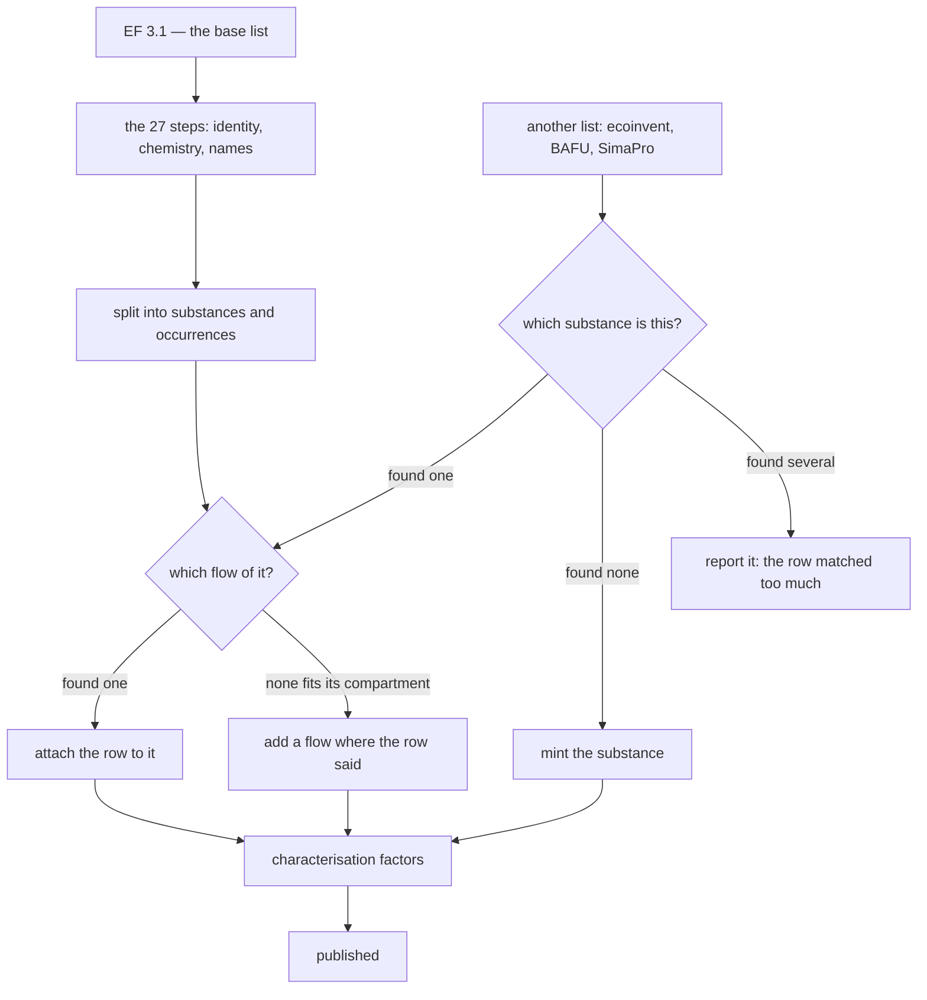

# How a flow is decided

A source list ships a row: a name, usually a registry number, a compartment, a
unit, and the vendor's own identifier. Some forty decisions later it is a flow
in the consensus list, with a settled identity, a chemistry it did not arrive
with, and a link back to the row it came from.

This page is those decisions, in the order they are made. Each one is a
question, and each links to the page that answers it in full. For the ordered
inventory of what each processing step does, rather than the reasoning behind
it, read [Harmonisation steps](../reference/harmonisation-steps.md) instead.

Three things are worth knowing before the first stage.

**No step edits a flow.** Each one proposes a change, the run applies it and
writes down which step made it and why, and where two of them write the same
field the later one wins. That is what makes every stage below answerable after
the fact rather than on trust: on the build quoted throughout this page, copper
carries 65 recorded changes, written by seventeen different parts of the run.

**Declining is a normal outcome.** At most of these stages the honest answer is
sometimes a question rather than a value, and the question goes into a review
queue for a person. A field that is empty is often a decision, not a gap.

**A flow enters through one of two doors**, and almost every question anybody
has about "the pipeline" is really about one door or the other.

## Two doors: transformed, or merged

**EF 3.1 is the base list, and it is *transformed*.** Every one of its 93,993
rows goes through twenty-seven processing steps in a fixed order, and what comes
out is the consensus list. Stages 1 to 7 below are that journey.

**Every other list is *merged*.** ecoinvent, BAFU, a SimaPro-lineage method
file: their rows are matched against a consensus list that already exists, and
a row becomes something new only when nothing it could belong to is found.
Stage 8 is that journey, and stages 6, 7 and 9 then happen again on its terms.

The difference is visible in any flow's history. `Copper` came through the first
door, and its change log names every part of the run that touched it.
`Copper, Ion` came through the second, and its change log is **empty** — the
chain had finished before
ecoinvent's row arrived, and everything true of that substance was decided by
the merge and the passes after it.

Figures on this page are from the build of 25 August 2026, run
`20260825T1354430622920000`, revision `1c1385b`: EF 3.1, then ecoinvent 3.12,
ecoinvent 3.8 and BAFU 2026-v1 merged in that order.

Copper is the worked example throughout, because it goes through both doors:
EF 3.1 ships the metal, ecoinvent ships an ion of it, and the two end up as two
substances that share a number.

## 1. What did the source list actually ship?

Whitespace is stripped, capitalisation is regularised, and any manual fix the
list carries is applied to the raw row *first*, because a fix names the
vendor's own field names. A row that cannot be made into a valid record is
dropped rather than guessed at. EF 3.1 spells copper `copper`; it is
title-cased here, and the change log says which rule did it.

Then the row's own words are kept. Every flow carries a `source_refs` entry
recording the list, the version, the vendor's identifier, and — verbatim — the
name and the compartment strings as shipped. This is not bookkeeping for its own
sake: it is what lets you audit a merge afterwards, and it is what makes the
output usable as a translation table between two lists.

Nothing is deduplicated here. Two lists supplying the same substance in the same
compartment produce two rows at this point, and stay two rows until there is
enough resolved identity to collapse them correctly.

**Where it is written down:** `elementary_flow_sources`, and the **Source
lists** panel on any flow's page. See [Choosing
sources](../operating/sources.md).

## 2. Which compartment is this, in our words?

Every list names its compartments differently, and none of them uses this
project's vocabulary. `emissions to air / unspecified`, `air`, `Emissions to
air, indoor` all have to resolve to one identifier from a deliberately small
controlled list — and from this point on that identifier, not the display
strings, is what "the compartment" means.

The unit resolves at the same time, and a unit that resolves to nothing stops
the run. A flow whose unit is unknown cannot be compared with any other flow's,
and guessing one would make an incomparable pair look comparable.

**Where it is written down:** `context_iri` on the flow, and
`context_default_mappings`. See [Flow contexts](../concepts/contexts.md).

## 3. Is this the substance the number says it is?

A registry number designates one substance by construction. A name designates
whatever the person writing it meant. So the number outranks the name — and the
hard part is that getting this wrong does not look like trusting a name, it
looks like trusting CAS Common Chemistry, which is the most authoritative source
of registry numbers there is.

Before anything is looked up, the numbers themselves are checked: CAS and EC
both carry a check digit, transcription errors are proposed as corrections where
the intended number is unambiguous, and each CAS ↔ EC pairing is tested against
ECHA's own inventory. A row with no number at all can take one from its own
name, but only where that name means exactly one substance — `Borax` is both
the decahydrate and the anhydrous salt, and a name that means two substances has
identified neither.

Copper arrives from EF 3.1 with 7440-50-8 and no EC number at all; the
cross-check looks that number up in the inventory and fills in 231-159-6,
saying so in the change log. ecoinvent's `Copper ion` arrives with **no
registry number at all**, which turns out to be the whole of its later story.

**Where it is written down:** `changelog`, under the step that wrote it;
disagreements in the `commonchem-cas-name-differences`, `commonchem-name-cas`,
`ec-malformed` and `ec-cross-check` queues.

**In full:** [What do we do when the name and the CAS number don't agree?](identity.md)

## 4. What is this substance made of, and what shape is it?

Now that the identifiers are trustworthy, they are used to look things up.
ChEBI and PubChem supply synonyms, cross-references, formulae and structures —
and this is where a mis-linked record would do the most damage, so four guards
stand in front of it. A cross-reference somebody else made is not evidence. A
ChEBI record whose formula disagrees with the flow's is not this substance. A
PubChem compound whose own curated registry section does not list the number
that found it is dropped. And a number that reaches several substances narrows
before it enriches, or it enriches nothing.

Structure is then **computed rather than asserted** — formula, mass and InChIKey
derived from a structure are arithmetic, not testimony — but only where identity
is unambiguous enough to be certain what is being computed from.

Two sources will still draw one substance differently: with a stereochemistry
and without, as an acid and as its ion, as a formula that cannot be written as a
structure at all. Those are not one question, and the pages below take them
apart.

**Where it is written down:** `changelog` under `enrich_references`,
`rdkit_*` and `opsin_iupac`; `formula_mismatches`; and the `cas-ambiguous` queue.

**In full:** [What do we do when one registry number reaches several substances?](registry-numbers.md) · [What do we do when two sources draw the same substance differently?](structures.md) · [What do we do when the formula cannot be drawn?](salts.md)

## 5. What should it be called?

The published name is chosen from candidates across ChEBI, the EC inventory,
PubChem and Common Chemistry, and only where explicit confidence rules are met —
typically several independent sources agreeing. Where they do not agree it does
not guess; the case goes to a queue.

Two cleanup passes run *before* that choice rather than after it, so the scoring
never sees a contaminated set of names: a synonym that is some other substance's
preferred name is removed, and so is an element symbol on anything that is not
the pure element. Two more run after everything else has finished writing names,
to take out the strings that are catalogue entries rather than names — supplier
grades, trade names with a product number, database accessions.

**Where it is written down:** `changelog` under `consensus_match` and the strip
steps, and the `consensus-match` and `undecided-label-replacement` queues.

**In full:** [What do we do with a name that belongs to something else?](synonyms.md)

## 6. Is this one substance, or two?

When the steps have finished, the flows are split into two layers: the
substances, and the occurrences of them. Identity is the registry number,
falling back to the normalised name — except for a flow whose name is exactly a
nuclide, which is grouped by its nuclide, because both source lists put the
*element's* number on some nuclide rows.

Three things then pull that grouping apart or hold it together:

- **An origin qualifier splits a substance.** Biogenic and fossil carbon dioxide
  are two substances, not one substance twice, and so are green, blue and grey
  water.
- **A number two names share is a question, not a merge.** 794 numbers were in
  that position on an earlier build; where a curator has ruled that they name
  two substances the flows are held apart, and where nobody has ruled they stay
  merged and go to the `contested-cas` queue. Staying merged is the
  conservative answer, because splitting a substance nobody asked to split
  strands every characterisation factor pointing at it.
- **Each substance is typed from its chemistry**, not from its name — which is
  what catches `Chloride` and `Sodium ion`, where a pattern over the label
  missed them.
- **A compound and the product it was sold as are two substances.** Chlordane
  the compound is 57-74-9; technical chlordane, the mixture of about a hundred
  chlorinated compounds that was actually sprayed, is 12789-03-6, and CAS
  publishes no substance record for it at all — which is what a registry does
  when a number names a manufactured product. Both stay, and then both names
  have to say which is which: `Chlordane, pure` and `Chlordane, technical`. The
  bare name stays searchable on the product, because the product is what an
  inventory reporting `chlordane` means
  ([#167](https://github.com/brightway-labs/brightway-flows/issues/167)).

Copper is typed a chemical element. `Copper, Ion` is typed a monatomic ion. They
are two substances, and the page on structures explains why an acid and its ion
are not two drawings of one thing.

**Where it is written down:** `run_stats` under `resolve_flow_layers`, and the
`contested-cas` queue. See [Flow objects and elementary
flows](../concepts/two-layers.md).

## 7. Is this flow one we already have?

Two flows of one substance, in one compartment, in one unit, are the same flow
however differently they are named. One stays live and the others are marked
deprecated with a pointer to it — deprecated rather than deleted, so a list that
mapped onto the retired identifier still reaches the survivor.

A name is not part of that signature. What holds a near-identical pair apart is
almost always the free-text note, and where the note is really prose rather than
a version string, the pair goes to a queue instead of being collapsed.

Where two collapsing flows both published a characterisation factor and gave it
different numbers, the number that is not published is kept on the one that
superseded it. A value the pipeline declined to write is the same kind of fact
as one it wrote.

**Where it is written down:** `run_stats` under
`deprecate_duplicate_elementary_flows`, and the `elementary-flow-collision`
queue.

## 8. Which flow does a row from another list belong to?

This is the second door, and it is two questions rather than one.

**Which substance?** Evidence is tried strongest first and the first rung that
answers is the answer: a curator's ruling, then the curated tables for land
classes, water materials and particle size windows, then the registry number,
then EC, then the row's own names, then names the row does not have. On this
build 13,547 of 15,609 placed rows were settled by the registry number alone
and never reached a name.

**Which of that substance's flows?** Flows in another medium are dropped
outright; if exactly one flow is in the compartment the row named, the row goes
there, and 13,790 rows were settled that way. Only 63 rows in the whole build
were decided by weighing candidates against each other.

ecoinvent 3.12's `Copper ion` reaches neither. It has no registry number, and no
substance in the list answers to that name — so it matched too *little*, and the
merge minted `Copper, Ion` with fourteen flows. When ecoinvent 3.8 was merged
afterwards, its own fourteen `Copper ion` rows matched that new substance on its
label. That is why merge
order is a property of the lists rather than of the command line: the first list
to reach a substance mints it, and everything after matches what it created.

**Where it is written down:** `merge_outcomes`, one row per source row, with
every candidate and its score in `detail_json`.

**In full:** [How does a row from another list find its substance?](merging.md) · [What do we do when no existing flow fits the row?](placing.md)

## 9. What number characterises it?

A method is not a number until somebody implements it against a flow list, and
two competent teams implementing EF 3.1 do not always get the same answer. So
each factor says who states it, and where two implementations disagree this list
publishes **nothing** and asks — that is the `contested-factor` queue.

Copper is the easy case: both implementations state 46.47592828149169 CTUe for
freshwater ecotoxicity from a release to surface water, so the number is
published as `agreed`. `Copper, Ion` is the interesting one. The JRC never
characterised an ion this list only has because ecoinvent shipped it; ecoinvent
gives the ion copper's own numbers; and because that number already stands
published, bit for bit, on another flow of the same category, it is published as
`restated` rather than queued as a proposal. All 48 of the ion's factors are of
that kind.

**Where it is written down:** `lcia_characterization_factors`, with a
`derivation` on every consensus factor, and the `contested-factor` and
`proposed-factor` queues. See [Characterisation
factors](../concepts/factors.md).

**In full:** [How a factor is decided](../deciding-factors/index.md) — a section
of its own, with the flowchart every consensus factor is a box of.

## 10. What happens when we cannot tell?

At every stage above, some rows do not meet the bar. Nothing is guessed. The
case goes into a review queue with what a person needs to decide it, and the
field stays empty until they do.

That is the design, not a shortfall: an artifact that states a number nobody can
defend is worse than one that asks a question. What makes it workable is that
the questions are enumerable, each carries its evidence, and every answer a
curator gives is a file in the repository rather than a value typed into a
database.

**In full:** [What happens when the evidence is not good enough?](unresolved.md) · [How do I find out why a flow says what it says?](provenance.md)

## The pages in this section

| Page | Asks |
|---|---|
| [Which sources do we believe, and how far?](sources.md) | which source may settle a question alone, and which may only corroborate |
| [What do we do when the name and the CAS number don't agree?](identity.md) | a row carries both, they say different things, and one of them has to win |
| [What do we do when one registry number reaches several substances?](registry-numbers.md) | the guards on everything ChEBI, PubChem and Common Chemistry are asked |
| [What do we do when two sources draw the same substance differently?](structures.md) | structures, stereochemistry, and what a registry number does and does not claim about shape |
| [What do we do when the formula cannot be drawn?](salts.md) | salts, where the formula and the structure are not the same statement |
| [What do we do with a name that belongs to something else?](synonyms.md) | the synonyms that are another substance's name, or a supplier's part number |
| [How does a row from another list find its substance?](merging.md) | the evidence a merged row is matched on, strongest first |
| [What do we do when no existing flow fits the row?](placing.md) | which occurrence of that substance the row means, and when a new one is made |
| [What happens when the evidence is not good enough?](unresolved.md) | the review queues, and why declining is a normal outcome |
| [How do I find out why a flow says what it says?](provenance.md) | the change log, the provenance record, and the values that were declined |
