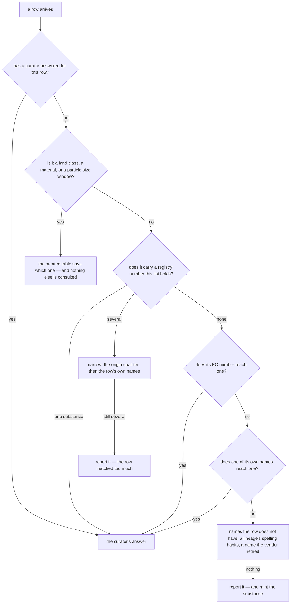

# How does a row from another list find its substance?

*Part of [How a flow is decided](index.md), at the stage where a list that is
not the base list is brought in. This page is the first half of that: which
**substance** a row is about. The second half — which of that substance's flows
— is [what do we do when no existing flow fits the row?](placing.md)*

EF 3.1 is transformed into the consensus list. Every other list is *merged*:
its rows are matched against what already exists, and a row becomes something
new only when nothing it could belong to is found.

Figures on this page are from the build of 25 August 2026, run
`20260825T1354430622920000`, revision `1c1385b`: EF 3.1 as the base list, then
ecoinvent 3.12, ecoinvent 3.8 and BAFU 2026-v1 merged in that order — 16,953
rows between them.

## The ladder

A row arrives carrying a name, sometimes a registry number, a compartment, a
unit and the vendor's own identifier. Evidence is tried **strongest first**, and
the first rung that answers is the answer. A row that matches on its registry
number never reaches the rungs below it, which is the point: those rungs read
names, and a name is the weakest thing on the row.

Each rung writes its own name into `merge_outcomes.basis`, so a curator reading
a match back can tell what settled it. Over the 15,609 rows that the algorithm
placed:

| `basis` | Rows | What answered |
|---|---:|---|
| `cas` | 13,547 | the registry number, reaching exactly one substance |
| `label` | 1,019 | a name the row itself carries |
| `land_class` | 400 | a curated land-class table |
| `material` | 326 | a curated material table |
| `cas+qualifier` | 126 | the number, narrowed by an origin the name states — biogenic, fossil, land use change, green/blue/grey water |
| `cas+label` | 67 | the number, narrowed by one of the row's names |
| `simapro-name-pattern` | 39 | a spelling this project derived, not one the vendor shipped |
| `prepared_mapping` | 32 | a curated row-to-flow correspondence |
| `cas+label+preferred-name` | 23 | as `cas+label`, needing the published name to break a last tie |
| `particulate_size_class` | 15 | a curated size-window table |
| `historical-name` | 11 | a name the vendor itself retired |
| `label+preferred-name` | 3 | a name, needing the published name to break a tie |
| `ec` | 1 | the EC number, where the registry number reached nothing |

## First: has a curator already answered for this row?

A ruling for a named row beats everything below. 403 rows were placed this way,
from the lists' own `match_overrides` files — 196 in ecoinvent 3.8, 184 in
3.12, 23 in BAFU.

A ruling can also be a *refusal*. An override that says "not this one" returns
the row to the ladder rather than placing it, so a curator can rule out a wrong
match without having to state the right one.

## Three kinds of row are answered by a table, and by nothing else

A land-use class, a material of water, and a particle size window are each
looked up in a curated table, and if the table answers, no other rung is
consulted at all.

The exclusivity is the fix, not a precaution, because these rows have nothing
else worth reading:

- **A particle size window.** Not one of the 233 rows in the size-class table
  carries a registry number, so before this rung existed they fell through to
  their names — and the names are not theirs to trust. `Particles (PM10)`
  carries both of ecoinvent's coarse-fraction spellings as synonyms, so four of
  BAFU's coarse-fraction rows matched PM10 on a label while BAFU's actual PM10
  rows matched nothing at all and minted substances with no factors
  ([#153](https://github.com/brightway-labs/brightway-flows/issues/153)).
  Fifteen rows are placed by their window on this build.
- **A material of water.** Every water variant shares 7732-18-5, so a registry
  lookup returns ten candidates and narrows to none — which is how ecoinvent's
  `Water, green` came to match nothing at all and leave the list, before the
  materials had objects of their own to be looked up in. 326 rows are placed by
  their material on this build, 284 of them BAFU's.
- **A land-use class.** A curated row says which class this is, and a land flow
  has no registry number for a later rung to disagree with. BAFU's
  `Occupation, annual crop, non-irrigated, intensive` and EF's `arable,
  non-irrigated, intensive` decompose to one class and meet — where before,
  BAFU's 123 land rows matched nothing and every one of them minted a duplicate
  of a flow EF already published. 400 rows on this build.

## Then the registry number

13,547 rows — 87% of everything the algorithm placed — are settled here and go
no further. ecoinvent's `Flurochloridone` in air carries 61213-25-0, exactly one
substance in the list carries it, and that is the whole decision.

**The number outranks the name, and it is meant to.** ecoinvent's
`Benzoylprop-ethyl` carries 22212-55-1 and lands on a substance this list
publishes as `Ethyl N-benzoyl-N-(3,4-dichlorophenyl)-DL-alaninate`. Nothing
about those two strings suggests they are the same thing. The registry number
says they are, and it is right.

### When one number reaches several substances

Several substances can carry one number — every water variant shares
7732-18-5 — so the candidates are narrowed rather than guessed between.

**By the origin qualifier first**, read from *every* name on the row and not
only the published one: `Water, well, in ground` carries the qualifier and the
name the enrichment settled on may not. 126 rows are placed this way.

**Then by the row's own names**, against the candidates the number already
found: 67 rows, and 23 more that needed the published preferred name to break a
last tie.

**Then, for a list SimaPro shaped, by the designation at the end of the name.**
ecoinvent 2 named twelve fluorinated ethers as structural prose with the
industry designation appended — `Ether, 1,1,2,2-Tetrafluoroethyl
2,2,2-trifluoroethyl-, HFE-347mcc3` — and gave every member of the family one
CAS. The full name is nobody's published label, so the narrowing above reads
nothing, and the last comma-segment is the only part that names one substance.
It can only choose among substances the number already reached, and can never
introduce one.

### When a qualifier nothing in the list carries rules every candidate out

If the row's name carries a qualifier this vocabulary recognises and **no
substance in the list carries that qualifier at all**, then every candidate the
number found has been ruled out by the row's own name. There is nothing left to
choose between, so the row is reported as having no candidate — which is a
reason the merge is allowed to mint a substance for.

Without it, `Carbon dioxide, non-fossil, resource correction` falls through to
the names and lands on plain `Carbon Dioxide`, the substance the qualifier
exists to distinguish it from
([#133](https://github.com/brightway-labs/brightway-flows/issues/133)).

Both halves of that are visible on this build. ecoinvent 3.12's row carries
124-38-9, no carbon dioxide in the list carried its qualifier, and the merge
minted `Carbon Dioxide (biogenic, resource correction)` for it. ecoinvent 3.8's
identical row, arriving after that substance existed, was placed on it by the
ordinary narrowing, `basis` reading `cas+qualifier`.

The rule is deliberately narrow. It fires only where a qualifier is carried by
nothing whatever — on this build that is `blue_water` and `grey_water` — and
never where it is carried by substances that merely do not share this number,
which is a different population nobody has counted.

### A name that states a charge never reaches the bare element

A row called `Rhodium III`, `Palladium (II)` or `Copper ion` is an ion, and
the bare element is the one substance its name exists to distinguish it from.
So when a row's name parses as an ion of the element/ion family and the only
thing a name finds is that element, the candidate is refused and the row is
reported as having no candidate — which lets the merge mint the ion, as it
would have for a row nobody's name reached
([#198](https://github.com/brightway-labs/brightway-flows/issues/198)).
The unmatched record says `label+ion-element-refused`, and because minting
replaces that record, the created row carries the same string as
`unmatched_basis`, so a curator can tell the refusal from a row no name
reached at all.

Without it, ecoinvent 3.12's `Rhodium III` and `Palladium II` — seven rows,
each carrying the ion's own registry number — were published as the metals.
EF 3.1 holds neither ion, so the number found nothing, and ecoinvent's own
bare synonym `Rhodium` hit the element's preferred label, which the label rule
above accepts. AGRIBALYSE's rows for the same two substances, arriving later,
minted ion flows, so one substance in air had two published flows and the
read-only lookup disagreed with the build.

Only label evidence is judged. A row whose *number* is the element's —
ecoinvent's `Strontium II` and `Caesium I` under 7440-24-6 and 7440-46-2,
AGRIBALYSE's six generic `Antimony, Ion` to `Titanium, Ion` names — matches
on the number and never reaches this rule. What such a number means is a
ruling about the vendor's data, not a rule of the merge; AGRIBALYSE's
`Lithium (I)` and `Potassium (I)` got theirs in
`agribalyse-3.2-manual-fixes.json`, and the others are open.

## Then the EC number

One row on this whole build, and it earns the rung.

BAFU ships four `Sulfur Dioxide` rows. Three carry 7446-09-5 and are placed by
it. The fourth carries `2025884`, which nothing in this list holds, and its EC
number 231-195-2 takes it to the same substance the other three reached. Without
this rung that row would have minted a second sulfur dioxide with no
characterisation factors on it.

## Then the row's own names

1,019 rows, split almost evenly between the three lists. This is also where the
merge order becomes visible.

ecoinvent 3.12's `Copper ion` carries **no registry number at all**. No
substance in the consensus list answers to that name either, so all fourteen of
its rows are reported as having no candidate and the merge mints `Copper, Ion`
for them. ecoinvent 3.8 is merged next, and its own fourteen `Copper ion` rows
match on the label against the substance 3.12 had just created. `basis_value`
reads `Copper ion; Copper, Ion`.

That is why the merge order is a property of the manifests and not of the
command line: the first list to reach a substance mints it, and every list after
it matches what that list created.

## Last: names the row does not have

Two rungs read names this project derived or recovered rather than names the
vendor shipped, and both are deliberately at the bottom.

- **A SimaPro lineage's spelling habits.** `Benzene, Chloro-` is chlorobenzene.
  39 rows, all BAFU's.
- **A name the vendor itself retired.** ecoinvent 2.2 said `Laterite, in
  ground` and `Sulfate, ion`; every release since says `Laterite` and
  `Sulfate`, and the vendor's own 2.2 → 3.12 correspondence records the pairs.
  11 rows — 7 of BAFU's, 4 of ecoinvent 3.8's.

They are last because a derived spelling is a weaker claim than anything above
it. A row that matches on its number or on its own name never sees one, so an
entry that is wrong can only touch a row that was going to be reported anyway —
or minted as a duplicate of a flow the list already publishes, which is how
ecoinvent 3.8's `Sulfate, ion` came to sit beside `Sulfate`. Written in as a
synonym *before* matching instead, a derived spelling would join the names every
rung above reads, where a wrong one can move a match that was already right.

## Two candidates left is not an answer

If the ladder ends with several candidates still standing, the row is reported
and nothing is written. If it ends with none, the row is reported **and the
substance is minted**.

Those look similar and are opposite. Several candidates mean the row matched
*too much*, and choosing between them is a guess. No candidate means it matched
too little, and there is a substance here the list does not have — 941 rows on
this build, in which `Copper, Ion` is one of the substances created.

An identifier is never inherited from the source row when a substance is
minted. The reason is editorial: republishing a licensed vendor's keys as
consensus keys puts them in the published artifact more prominently than this
project wants.

## A place can be minted as well as a substance

The other thing the merge creates is a flow of an existing substance in a
place the list did not hold. AGRIBALYSE's `Cadmium (II)` released to a river
finds its substance by registry number — the published `Cadmium(2+)`, with
flows in seventeen other places — and no flow of it in the river. Every
candidate either names a different water body or says less than the row does,
so the selector refuses, and the refusal creates: the row gets its substance's
flow in the river, the way BAFU's river metals got theirs.

That is a ruling, decided on #186 after the alternative was built and
measured. A preference that coarsened river rows onto Surface water — a water
body outranking the `Long-term` bucket wherever the two tied — would have
answered a question the vendor already answered, and re-decided 273 BAFU and
Stepwise rows whose published river flows would have retired. For an emission,
the stated sub-compartment wins. For a resource the reasoning runs the other
way: a wrong sub-context there is a data error (`Occupation, …` filed among
ores), and those rows are re-filed by the context rules and per-row fixes
before matching ever runs.

A flow minted this way often carries no characterisation factor, and that is
accepted, deliberately: where a factor should reach a sub-place its category
does not distinguish is the factor work's own question (#138), and letting it
into the mapping would make the list say a row *is* something because that is
where the numbers are.

## Where it is written down

`merge_outcomes`, one row per source row, in `consensus-flows.sqlite3`. It
records the outcome, the `basis` and `basis_value` that settled it, the
substance and flow it reached, and — in `detail_json` — the row as it arrived
and everything the decision was made from. On this build every one of the 16,953
rows reached a flow, so nothing was reported unplaced; a run where that is not
true is asking a question, not failing.
