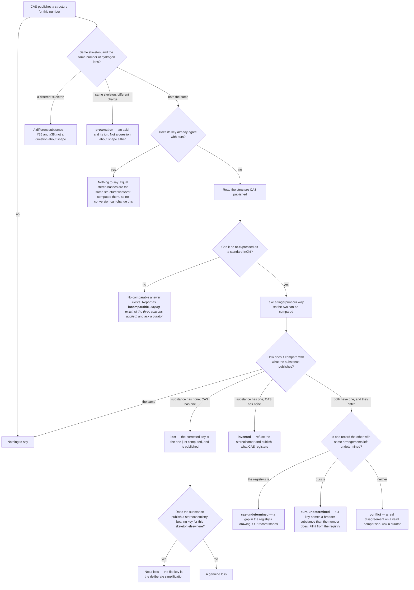

# What do we do when two sources draw the same substance differently?

*Part of [How a flow is decided](index.md), at the stage where a substance's shape is settled.*

## Structure is computed, not asserted

Names and registry numbers come from sources and may be wrong. Molecular
formula, mass, and InChIKey can be *derived* from a structure, which is
arithmetic rather than testimony.

Where a flow's IUPAC name parses unambiguously with OPSIN, its SMILES and InChI
are replaced with values derived from that parse. RDKit then recomputes formula,
masses, and InChIKey from the resulting InChI — but only for flows whose
identity is unambiguous: exactly one IUPAC name, no origin qualifier, and an
InChIKey unique across all non-qualified flows. When those conditions do not
hold, the existing values are left alone.

This is why the eligibility conditions are strict. Computed values are only
better than asserted ones when you are certain what you are computing from.


## The structure gate: a registry number need not denote a structure

The curated-CAS gate above decides *which* compound a CAS number means. It
cannot help when a CAS number does not mean a compound at all.

Plenty of registry numbers name a UVCB, an unspecified isomer, or a commercial
mixture. `1300-21-6` is "dichloroethane" with no isomer stated; `68475-60-5` is
"alkanes, C4-5"; `8006-64-2` is gum turpentine. None of them denotes one
molecule. PubChem answers all of them anyway, because its cross-reference index
returns whatever compounds were standardised onto the number:

| CAS | Substance | PubChem returns |
|---|---|---|
| 1300-21-6 | dichloroethane, isomer unstated | CID 6365, **1,1-dichloroethane** |
| 68475-60-5 | alkanes, C4-5 | CID 8003, **n-pentane** |
| 8006-64-2 | gum turpentine | CID 6506, **triethyl citrate** |
| 111937-03-2 | isononanoic acid, C16-18 esters | CID 962, **water** |

Each returns a *single* compound, which is why neither the curated-CAS gate nor
the formula-similarity filter caught them: both treat one candidate as
unambiguous, and an unopposed wrong answer is not ambiguous. The mixture then
carried a specific molecule's structure, and collided under InChIKey with the
substance it had borrowed it from — the 1300-21-6 flow object against the real
1,1-dichloroethane at 75-34-3.

CAS Common Chemistry is the source that can tell these apart, because it is the
registry — but only partly, and the part it cannot is the reason this rule has a
curated component. Its records come in four shapes:

```
75-34-3      1,1-Dichloroethane   C2H4Cl2       InChIKey=SCYULBFZEHDVBN-…
68475-60-5   Alkanes, C4-5        Unspecified   (no key)
1300-21-6    Dichloroethane       C2H4Cl2       (no key)
10028-15-6   Ozone                O3            (no key)
```

The second is unambiguous: CAS is saying the number has no definite composition
at all. The third and fourth are **identical in the record and opposite in
meaning** — an isomer family, and a single molecule Common Chemistry simply
holds no key for. 319 of the 836 answered-with-no-key records are that shape,
and they include ozone, nitric oxide, nitrogen dioxide, chlorine dioxide and
doramectin. Reading them all as non-specific would strip ozone's structure.

**The rule, in three parts:**

- **A number with no composition lends no structure.** `molecularFormula:
  "Unspecified"` is CAS stating there is nothing definite to give, so neither
  PubChem nor ChEBI is consulted through that number, however many or few
  candidates it has. 517 cached records. The number itself is still published
  and still links to its Common Chemistry and ECHA pages — only the structure
  is withheld.
- **A number with a formula and no key changes nothing, unless a curator has
  ruled on it.** The default is to do nothing, so a substance is only ever
  denied a structure by an explicit entry in
  `commonchemistry-structure-decisions.json`, each carrying a mandatory
  `comment` saying why the number is ambiguous. An entry without one is ignored.
- **Where Common Chemistry does give a structure, the candidate matching it
  wins.** One-sided in the same way as the curated-CAS gate: a contradicted
  compound is dropped only when another candidate is confirmed. Common
  Chemistry is strong evidence and not an oracle — for metaldehyde, CAS
  9002-91-9, it publishes acetaldehyde's InChIKey where our tetramer is the
  better answer — so a contradiction with nothing better to replace it goes to
  the queue rather than deleting a structure.

An **empty** cache record is neither answer. It means a 404 or a request that
failed after its retries, and 286 of the 7,409 cached entries are that shape.
Only a *named* record counts; an unnamed one changes nothing. A gap in the cache
must never withhold a structure, which is the same rule the curated-CAS gate
follows for compounds it never asked about.

Comparisons ignore the standard/non-standard flag — the 14th character of an
InChIKey's second block — **when the keys agree**. Common Chemistry publishes
non-standard keys freely and every other source here publishes standard ones, so
`…-CDRYSYESSA-N` and `…-CDRYSYESNA-N` are the same molecule. 22 flow objects
agree with Common Chemistry only once that character is disregarded.

**When the keys disagree, that flag decides whether they disagreed at all.** A
non-standard InChI is computed under options the key does not record, and CAS
reaches for them exactly when standard InChI cannot say what it needs — most
often `/s2`, *relative* stereochemistry, which standard InChI has no layer for:

```
Trans-4-tert-butylcyclohexanol   CAS  CCOQPGVQAWPUPE-KYZUINATNA-N
                                      InChI=1/C10H20O/…/t8-,9-
(2RS,4SR)-2-methyl-4-propyl-     CAS  GKGOLPMYJJXRGD-HGXVMFPFNA-N
  1,3-oxathiane                       InChI=1/C8H16OS/…/t7-,8+/s2
```

40 of the 75 non-standard keys in the cache carry `/s2`. No standard key can
ever equal one of them, so a difference against one is not the registry
contradicting a structure — it is two hashes of different things. Those get a
third verdict, `incomparable`, and the candidate is kept exactly as an
uncached CAS's candidates are: nothing was said against it. A skeleton
difference is still a contradiction whatever the flags say, because no InChI
option moves the connectivity hash.

Against the 2026-08-07 build, with 33 seeded rulings, the gate withholds a
structure from **181 flow objects** carrying 2,286 elementary flows, and
dissolves **49 of the 105 InChIKey collisions** described in
[the identity limitations](../reference/limitations.md#some-flow-objects-merge-unrelated-substances).
Every CAS it acts on is listed in the **CAS publishes no structure** queue of
the [review application](../operating/review-app.md).

## The stereochemistry gate: a flat registration is a statement

The gate above asks *which substance* a number means. This one asks *which
isomer of it*, and it is the one rule here that is not comparative.

CAS registers `4170-30-3` as `Crotonaldehyde` with a flat InChIKey —
`MLUCVPSAIODCQM-UHFFFAOYSA-N`, no stereo layer — and registers the *trans*
isomer separately as `123-73-9`. The flat key is not a gap in the record. It is
the registry saying which of the two substances the number denotes:

| CAS | Substance | Key |
|---|---|---|
| 542-75-6 | 1,3-Dichloropropene | `UOORRWUZONOOLO-UHFFFAOYSA-N` |
| 10061-01-5 | *cis*-1,3-dichloropropene | `UOORRWUZONOOLO-YFHOEESVSA-N` |
| 4170-30-3 | Crotonaldehyde | `MLUCVPSAIODCQM-UHFFFAOYSA-N` |
| 123-73-9 | *trans*-crotonaldehyde | `MLUCVPSAIODCQM-BUHFOSPRSA-N` |

Every source a structure is looked up in disagrees, and all in the same
direction. ChEBI's entry for a common name is usually the stereo-defined natural
isomer; PubChem's CAS index answers with a compound it has a record for — and a
substance whose stereochemistry is unstated is not a compound either of them
holds. The flow object got the *trans* key, and then collided under InChIKey
with `trans-2-butenal`, a different substance with its own number.

**None of the gates above can catch that, and it is not an oversight in them.**
They weigh candidates against each other and act only when one is better. Here
there is no better candidate: in 20 of the 33 affected flow objects PubChem and
ChEBI hand back the *same* stereo-specific structure, so nothing is contradicted
and nothing is confirmed, and the narrowing gate returns early exactly as
designed. Waiting for a source to disagree is waiting forever.

**The rule:** where Common Chemistry publishes a **flat** key for a number, from
a **standard** InChI, a candidate structure that shares its skeleton and carries
stereochemistry is refused — from PubChem and from ChEBI alike, however many
sources offer it, and with no better candidate required. All three conditions
are needed. A flat candidate agrees and is untouched, which is the overwhelming
majority: 5,726 of the 6,300 keyed numbers in the cache are flat. A different
skeleton is a different substance and a different problem, left to the gates
above. And a flat *non-standard* key states nothing, because those options can
suppress stereochemistry the substance really has.

Because the refusal can empty the candidate list, **the structure CAS does
publish is put back in its place** — the key, the InChI and the formula, under
`enrich_references.commonchemistry_semantic`. This is the only place Common
Chemistry is a source of structure rather than a referee of other sources'
structures, and it earns that here because it is the only source that holds the
answer. Withholding alone would trade one defect for another: a flow object with
no chemical identity at all. No SMILES is invented, because a value computed
from the InChI belongs to the stage that computes it.

On the 2026-08-12 build the gate acts on **90 registry numbers**, withholding 27
PubChem compounds and 70 ChEBI records across **100 flow objects**. The "stereo
invented" band of
[#42](https://github.com/brightway-labs/brightway-flows/issues/42) goes
from 33 flow objects to **nought**, and all 33 now publish the key CAS registers
and no other. Its "lost" and "conflict" bands are untouched, as is every one of
the skeleton disagreements — this rule reaches only the isomer question.

No flow object lost its structure: all 100 still publish an InChIKey, an InChI
and a SMILES. The collisions the invented stereochemistry manufactured are gone
— `Crotonaldehyde` now holds `MLUCVPSAIODCQM-UHFFFAOYSA-N` against
`Trans-2-butenal`'s `-NSCUHMNNSA-N`, and `1,3-dichloropropene`
`UOORRWUZONOOLO-UHFFFAOYSA-N` against the (Z)-isomer's `-UPHRSURJSA-N`.

Every number it acts on goes to the review queue: the registry's flat key is the
whole of the evidence, and where the isomers are not separately registered a
curator should be able to call it a gap rather than a statement. Three of the
100 are flows whose *name* asserts a stereochemistry — a racemate, a reaction
mass, and one whose own source InChI is flat and so agrees with the registry
against its name. All three are in the queue, which is where that judgement
belongs.

## Reading the structure, not the fingerprint

The gate above answers one question — does this number have a stereochemistry at
all — and it answers it from CAS's InChIKey. That is a fingerprint of a
structure, not the structure, and a fingerprint records *how it was taken*. CAS
takes many of its fingerprints a different way from every other source here, and
two taken differently cannot be held up against each other. For those numbers
the honest answer used to be "no comparable answer", and a real defect and a
false alarm looked exactly alike.

But CAS also publishes the structure itself, alongside the fingerprint. A
structure can be read and written out again — and then a fingerprint taken *our*
way, which can be compared:

```
trans-4-tert-butylcyclohexanol, 21862-63-5
    CAS publishes    CCOQPGVQAWPUPE-KYZUINATNA-N
    read and retaken CCOQPGVQAWPUPE-KYZUINATSA-N
                                    ^^^^^^^^ the same stereochemistry, all along
```

On the 2026-08-12 build that answers **22 of the 56** substance-and-number pairs
where CAS states a stereochemistry the list does not match — and for a *loss* it
does more than answer, because the corrected value is exactly what was just
computed. Seven of the ten losses now arrive at the review queue with the key
the substance should carry, rather than only the news that it is wrong.

**The other 34 must stay unanswered, and that is the part to be careful about.**
CAS reaches for its own way of taking a fingerprint mostly to say something
standard chemistry notation cannot: a *relative* stereochemistry — "these two
centres are arranged so with respect to each other, in either mirror image".
RDKit does not refuse such a structure. It reads it and hands back **one** of the
two mirror images, with nothing in the answer saying a choice was made:

```
(2RS,4SR)-2-methyl-4-propyl-1,3-oxathiane, 59323-76-1
    CAS says       GKGOLPMYJJXRGD-HGXVMFPFNA-N   either mirror image
    RDKit returns  GKGOLPMYJJXRGD-JGVFFNPUSA-N   one specific mirror image
```

Accepting that would invent a stereochemistry the registry never claimed, which
is the defect this whole section exists to stop. So the relative and racemic
cases are detected *before* any conversion is attempted, and return nothing.

Two further notes for anyone extending this. Enhanced stereochemistry — RDKit's
model for "either mirror image" — holds the meaning correctly in memory but
produces the same fingerprint as the absolute form, so it is no way round the
problem. And a fingerprint showing no stereochemistry has two causes it writes
identically: a molecule with nothing to state, and a molecule whose arrangement
was not stated. Counting stereocentres tells them apart, and anything deciding
whether a substance has *lost* its stereochemistry needs that difference, or it
reports every simple molecule in the list.

## How a stereochemistry difference is decided



**Agreement is asked first, and it costs nothing.** Two keys with the same stereo
hash describe the same structure whatever computed them — that is the half of
#42's warning about the standard flag that was always right, and it means a
conversion cannot change the answer where the keys already agree. Asking it
second is how `Zinc-65` came to be reported as an impossible comparison against a
key identical to its own
([#55](https://github.com/brightway-labs/brightway-flows/issues/55)).

**A refusal names its own reason.** Re-expressing CAS's structure declines for
three different reasons, and reporting the wrong one is a defect in its own
right:

| Reason | What it means | Where it comes from |
|---|---|---|
| `relative` | A relative or racemic arrangement, which standard InChI cannot write down. Converting would pick one mirror image and not say so | 40 of the 75 non-standard keys in the cache |
| `altered` | The structure did not survive the round trip, so it cannot be trusted. RDKit's InChI reader drops the isotopic layer of a lone labelled atom — `InChI=1S/Zn/i1+0` comes back as `InChI=1S/Zn` | every isotope-labelled single atom |
| `unreadable` | Empty, or RDKit would not parse it | — |

The middle one is the guard working, not a stereochemistry. It used to be
reported as the first, which is how a queue row came to describe a single zinc
atom as having a relative stereochemistry.

The branch marked **invented** is the gate described above. **conflict** is
reported and left alone: both sides state a shape, the comparison was valid, and
nothing here can say which is right. The final question — whether a flat key sits
beside a specific one — is what separates a real loss from the simplification the
list publishes on purpose, and is
[#50](https://github.com/brightway-labs/brightway-flows/issues/50).

The two questions at the top are asked *first* on purpose, and the charge one is
[#54](https://github.com/brightway-labs/brightway-flows/issues/54): see
[an acid and its ion](#an-acid-and-its-ion-are-two-substances-not-two-shapes)
below.

## A gap is not a contradiction

"Both sides state a shape and the shapes differ" turned out to be three findings
wearing one label, and the split matters because two of the three are not
disagreements at all
([#56](https://github.com/brightway-labs/brightway-flows/issues/56)).

α-cyclodextrin is a ring of six glucose units, and each unit has five corners
whose arrangement matters, so the molecule has thirty of them. Our record
describes all thirty; the registry's describes twenty-nine and leaves one blank:

```
ours   …,22-,23-,24-,25-,…      corner 24: pointing this way
CAS    …,22-,23-,24?,25-,…      corner 24: not determined
```

Every corner both records describe, they describe identically. But a fingerprint
is computed over the whole set of corners at once, so one blank in thirty
produces a completely different result — as different as inverting all thirty
would give:

```
ours   HFHDHCJBZVLPGP-RWMJIURBSA-N
CAS    HFHDHCJBZVLPGP-FXNRASGISA-N
```

**A fingerprint does not degrade gracefully**, so nothing comparing these two
records by fingerprint can tell "the same substance, described once fully and
once with a gap" from "two different substances". Fifteen rows arrived in the
review queue labelled identically for that reason.

The question is answered by *construction* rather than by reading the layers
off. Take the fuller record, mark as undetermined exactly what the sparser one
leaves undetermined, and ask InChI for the fingerprint of what remains. If that
is the sparser record's fingerprint, the sparser record **is** the fuller one
with those corners unstated, and the two agree everywhere both speak.

Comparing the arrangement layers directly is the obvious approach and it is
wrong, in a way that matters for two of the fifteen:

```
chloralose   ours  /t2?,3-,4+,5+,6?,7+/m0/s1
             CAS   /t2-,3+,4-,5-,6-,7-/m1/s1
```

Every assigned corner differs, and so does the flag saying which mirror image
the record was written for. That reads as a flat contradiction and is not one:
blank corners 2 and 6 in the registry's record and the rest re-canonicalises to
exactly ours. The mirror flag records which of two mirror images the corner list
describes, and *which* one that is depends on the set of corners being listed —
so the two layers cannot be compared element-wise across records that describe
different sets. Taking the fingerprint again is what avoids the trap.

The three answers want three different things:

| Kind | What it means | What happens |
|---|---|---|
| `cas-undetermined` | The registry leaves blank what we describe, and agrees everywhere else | Nothing. Our fuller record stands — a record that assigns every corner is not contradicted by one that leaves some undetermined. Reported at `INFO` so the next reader does not rediscover it |
| `ours-undetermined` | We leave blank what the registry describes | The same repair as a lost shape, below. Where it cannot be applied, the row stays open with the fuller key named in it |
| `conflict` | Each record states an arrangement the other contradicts | Reported at `BLOCKING`. Nothing here can say which side is right |

On the 2026-08-12 build the twenty `conflict` rows become **seven
`cas-undetermined`, one `ours-undetermined`, five repairs and eight conflicts**,
across 13 flow objects and 168 elementary flows. Where a structure cannot be
read at all the answer stays `conflict`, because that is the status quo and the
answer that sends a person to look.

## Restoring a stereochemistry no source holds

A genuine **lost** is repaired from the registry's structure. It is the only
place in the pipeline where evidence is used to *add* a structural claim rather
than to refuse one, so it is a step of its own, under its own provenance name —
`enrich_references.commonchemistry_stereochemistry` — rather than part of a gate's
write.

The reason it is safe here and nowhere else is that the registry is the only
source that *can* answer. `21862-63-5` is `trans-4-tert-butylcyclohexanol`; the
trans form is not a compound PubChem or ChEBI holds a record for, so both answer
the number with the shape-free structure, and the flow object publishes
`CCOQPGVQAWPUPE-UHFFFAOYSA-N` — which is also plain `4-tert-butylcyclohexanol`'s
key, so the two substances collide on it. Waiting for a source to disagree is
waiting forever, exactly as in the **invented** direction.

Five conditions, and each refuses a case that would otherwise be wrong:

| Condition | What it stops |
|---|---|
| The registry's structure re-expresses as a standard key | A relative or racemic registration, where reading the structure back invents an absolute arrangement |
| The registry's structure states a shape **at all**, asked of the InChI and not the key | `Zinc-65`, whose key looks stereo-specific because the second block hashes isotopes too — the shape being copied would be an isotope label ([#55](https://github.com/brightway-labs/brightway-flows/issues/55)) |
| Every candidate on the skeleton has a gap the registry fills — shape-free, or shape-*incomplete* in the sense above | Overwriting an answer a source did supply; a redundant flat key beside it is [#50](https://github.com/brightway-labs/brightway-flows/issues/50)'s business |
| Same skeleton | A different substance, which is [#35](https://github.com/brightway-labs/brightway-flows/issues/35) and [#38](https://github.com/brightway-labs/brightway-flows/issues/38) |
| Same protonation | An acid and its ion, which is [#54](https://github.com/brightway-labs/brightway-flows/issues/54) |

The partial case — a record missing *part* of its shape rather than all of it —
is the same repair, and it is the **safer** of the two, which is worth saying
because it looks like the bolder one. Filling a wholly shape-free record rests on
the registry alone: there is nothing in the candidate to agree or disagree with.
Filling a partial one rests on the registry having been checked against the
candidate first and found to state the same arrangement at every corner the
candidate describes. A record that contradicts ours at one corner and completes
it at another fails that test and stays a `conflict`.

`β-Endosulfan` is why it is worth doing. Five corners, of which the published
record describes two; the registry describes all five and agrees on the two.
α- and β-endosulfan are distinct regulated pesticides, and what distinguishes
them is exactly the corners left blank — so the published fingerprint was not
merely different from the registry's, it named a broader substance than the
registry number does. On the 2026-08-12 build the partial repair fires on **5
flow objects across 65 elementary flows**.

The key published is the **converted** one, not the registry's own. Six of the
seven wholly-lost numbers this fires on are registered with a non-standard InChI
whose key cannot be compared with anything else in the list, and the InChI is
published alongside it from the same conversion so that the two agree with each
other. No formula is written: stereochemistry does not change one.

Nothing is done silently. Each repair appears in the `stereo-disagreement` queue
as a `restored` row at `INFO`, saying which key was replaced and by what. Where
the replaced key carried part of a shape rather than none, its withdrawal is
folded into that same row rather than reported again as a discarded claim: one
event, one row.

## When the registry breaks a tie between two sources

A flow object can also end up with **two stereochemistry-bearing keys on the same
skeleton** — one from ChEBI, one from PubChem, with nothing in the pipeline
reconciling the two lookup paths against each other. `Pyrethrin I` publishes both
`ROVGZAWFACYCSP-VUMXUWRFSA-N` and `ROVGZAWFACYCSP-NEWSRXKRSA-N`, and anything
using an InChIKey as an identity sees two substances where there is one.

Where **one of those keys is the structure CAS registers for the number**, the
others are withdrawn. That is a weaker claim than it sounds, and deliberately so:
nothing is being chosen on Common Chemistry's authority. One of the object's own
keys has been independently reproduced by the registry, which means the others
describe something the registry does not call by this number.

The restraint is what makes it safe:

- A group where **no** key matches the registry is left entirely alone. That is
  the `conflict` band and the two undetermined bands above, which are settled or
  repaired rather than tie-broken —
  [#56](https://github.com/brightway-labs/brightway-flows/issues/56).
- A group where the registry has **no comparable answer** — a relative or racemic
  registration — is left alone for the same reason.
- A **flat** key in the group survives. It states nothing the specific key
  contradicts, and it is
  [#50](https://github.com/brightway-labs/brightway-flows/issues/50)'s.
- Skeleton and protonation must match, so a different substance or a different
  ionisation state is never in the group at all.

On the 2026-08-12 build this withdraws a key from **8 flow objects across 106
elementary flows**. Six are the pyrethrin esters — `Pyrethrin I` and `II`,
`Cinerin II`, `Jasmolin I` and `II` — where the withdrawn key is the surviving
one with the double-bond geometry left out. Because a structure claim is being
discarded rather than added, each withdrawal is reported at `REVIEW`, naming both
the key that went and the one that stayed.

One of the eight runs the other way, and the split above now says so out loud.
`Oxymetholone`'s withdrawn key states a double-bond geometry the registry does
not state at all, so the same number carries a `cas-undetermined` row beside its
`superseded` one: our record described more, and the tie-break took it. Keeping
it instead would mean asserting a geometry the registry does not, on one source's
word, and leaving two identities on the object — which is the defect the
tie-break exists to remove. So the rule stays uniform and the row stays `REVIEW`,
which is what a curator is being asked to look at.

## An acid and its ion are two substances, not two shapes

An InChIKey's last block records how many hydrogen ions the substance is
carrying. `N` is the neutral form; `M`, `L`, `K` are one, two and three ions
removed; `O`, `P`, `Q` are one, two and three added. It is the only block that
moves when an acid gives away a hydrogen ion, and the shape hash in the middle
does not move at all:

```
(2R,3R)-2,3-dihydroxybutanedioic acid, 87-69-4
    published    FEWJPZIEWOKRBE-JCYAYHJZSA-N    tartaric acid, C4H6O6
    published    FEWJPZIEWOKRBE-JCYAYHJZSA-L    tartrate, C4H4O6, two ions gone
    CAS says     FEWJPZIEWOKRBE-JCYAYHJZSA-N    the acid, as (+)-Tartaric acid
                                ^^^^^^^^ the same shape in all three
```

Both of those keys were on one flow object, one from ChEBI and one from
PubChem, in the field that says what the substance *is*. And because the
comparison against the registry reported a difference — correctly; a charge
difference is a real difference — the shape classifier read that answer as being
about shape, and filed the object at `blocking` as *"same skeleton, different
stereochemistry, both specific"* over two keys whose shape hashes are identical
character for character. A curator sent to settle a shape question would have
found there was no shape question to settle.

**Charge is therefore tested before shape.** The order is what fixes it: the
answer to "is this a shape disagreement?" was already decided by something that
is not a shape. Testing charge first also gets the question right when *both*
differ, because the last block is not touched by the InChI options the shape
hash depends on — so the charge comparison is valid on a pair where the shape
comparison could only shrug, and the row reports what can be reported.

Where the charge differs, the two keys are two substances in one identity field,
and the tie is broken exactly where
[the previous section](#when-the-registry-breaks-a-tie-between-two-sources)
breaks it: **only where one of the object's own keys is the structure the
registry publishes for the number**. Nothing is chosen on Common Chemistry's
authority; one key has been independently reproduced by the registry, so the
other describes something the registry does not call by this number, and it is
withdrawn.

The procedure, per registry number the object was reached through:

| Step | What it does |
|---|---|
| 1 | Re-express the registry's structure as a standard key, as everywhere else here. No comparable answer — a relative or racemic registration, or one that does not survive the round trip — and the object is left alone |
| 2 | Take the object's keys with the same skeleton, the same shape hash and the same InChI version. A different skeleton or a different shape is a different question, and has its own band |
| 3 | Is the registry's own charge among them? If not, stop: the registry has not reproduced anything, and choosing which ionisation state the object is for is a curator's judgement |
| 4 | Withdraw the rest, and report the removal at `review`, naming the key that went and the one that stayed |

Worked through on the example above: step 1 gives
`FEWJPZIEWOKRBE-JCYAYHJZSA-N`; step 2 keeps both published keys, since they
differ only in the last block; step 3 finds `-N` among them; step 4 withdraws
`-L` and leaves the object publishing tartaric acid alone, with a `review` row
saying tartrate was taken out and the acid stayed.

Step 2 is also why this needs no isotope guard, unlike the tie-break above:
block 2 hashes isotopic labelling as well as shape, so radium-226 and radium-224
differ in it and never reach step 3 together. Two keys that do reach it carry
the same label as well as the same arrangement
([#55](https://github.com/brightway-labs/brightway-flows/issues/55)).

Unlike its stereochemistry sibling this asks nothing about shape, so a pair with
no shape at all is treated the same way — `SLXKOJJOQWFEFD-UHFFFAOYSA-N` and
`-M`, 6-aminohexanoic acid and its anion, are two substances for the same
reason. Those were reported nowhere before: the classifier handed a number
registered without stereochemistry straight to the shape gate, which has nothing
to say about charge.

**Only the identity field is settled by this.** The object above also publishes
two formulas, `C4H6O6` and `C4H4O6`; two SMILES; two charges, `0` and `-2`; and
two masses. Those fields accumulate their candidates on purpose — a list there
states the ambiguity where a single value would hide it, which is
[#6](https://github.com/brightway-labs/brightway-flows/issues/6) — so
withdrawing the key does not touch them, and a reader joining on formula still
sees both substances.

On the 2026-08-12 build 15 flow objects publish two keys differing only in
charge. The registry's own answer is among the keys for 4 of them — the tartaric
acid above, `Enoxolone`, `Nadide` and `Aminocaproic Acid` — and those are the
withdrawals, across 52 elementary flows. The other 11 are mostly salts the
registry answers with a different skeleton altogether, so nothing is reproduced
and nothing is touched.

Two objects are reported as their own `protonation` rows at `blocking`, because
the registry does hold a key for the number and what the object publishes for it
is the ionised form: `Cupferron` (135-20-6), which is one of the 11, and the
ammonium salt of `34274-28-7`, which is not — it publishes the ion and nothing
else, so it has no clash of its own. The remaining objects clash without the
registry saying anything either way. Finding those needs no registry lookup at
all, since two keys on one object differing only in the last character is always
this situation, and that check is what
[#54](https://github.com/brightway-labs/brightway-flows/issues/54) leaves
open.
